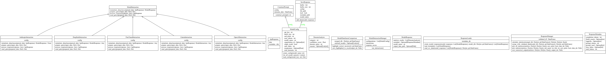
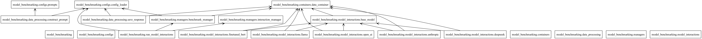

# Model Benchmarking

Welcome to the model benchmarking readme!

This tool was made to benchmark and evaluate different LLMs on their ability to characterize domains as malicious or benign (using same prompt as DRS from the iQ AI API).

### Explanation

There are two main parts to this module, **1)** preparing the validated data, making the prompts, sending the queries to models, getting and parsing the response and saving the responses, and **2)** taking this saved data, making plots and doing statistics on them, to benchmark the models against each other. This allows for separation of the model interactions (API calls) from the analysis (benchmarking).

The code for the first part, interacting with the models, can be divided into several parts:

* Taking validated data and constructing prompts. Prompts are constructed in data_processing/construct_prompt, validated data is from: `/validated_data/318_domains.csv`.
* A model config is made containing the runtime and static settings (`configs/model_configs.json`) as well as .env variables.
* The interactions with the APIs are made. Each provider (or sometimes specific model) has its own subclass implementation of the baseclass, found in `/model_interactions/`.
  After a query is made, the model response dataclass is instantiated with the data and validated.
* Returned data from the API calls are then saved, this is handled by the `data_processing/save_response.py`, data is saved to `/output_data/`.

In part two, after the model responses are saved, the data can be analyzed:

* The saved responses are again used to instantiate the `ModelResponse` dataclass, loaded from the saved metadata and data in `/output_data/`
* Statistics are calculated and plots are made, handled by the `run_model_benchmarking` manager class
* Highlighted comparisons can also be made by running the `run_highlighted_comparison` class

### Running the code

The entry point is the main file: `run_model_interactions.py` in the root of the `model_benchmarking` directory.
All settings and arguments are explained in the main file, and/or in docstrings.
**NOTE:** You also need to make a new .env file located in the root of the `model_benchmarking` directory containing the API keys.
Just install the requirements, and then in the main block run the code:

- `run_models` function handles the interactions with the API (part 1)
- `run_analysis` function handles the statistics and plots (part 2)
  - `run_highlighted_comparison` function makes the highlighted .xlsx file to compare models in detail.

Here is an example of running the code, this does everything from start to finish:

```
if __name__ == "__main__":
    run_models(selected_models=["gpt4-o", "llama"], batch_size=1, total_domains=2, single_mode=True, start_index=0)
    run_analysis(selected_models=["gpt4-o", "llama"], mode="single", analyses=["all"], save_plots=False, numerical_output=False)
    run_highlighted_comparison(["gpt4-o", "llama"], mode="single")
```

In this example, we first we make API calls and store the responses:

    `run_models(selected_models=["all"], batch_size=10, total_domains=300, single_mode=False, start_index=0)`

The run_models function takes the arguments:

- `selected_models` are the models used (can be all or specific model names)
- `batch_size` is how many domains are used in the same prompt
- `total_domains` are how many domains in total should be sent to the model(s)
- `single_mode` also called mode in analysis code) should be set to False if batch_size > 1, meaning several domains are sent in the same prompt. If single_mode = True, the code uses the single domains prompt from DRS and forces only one domain per prompt (even if batch_size > 1).
- `start_index` is where in the validated data we index into to construct the prompts containing the domains data, a start_index of 0 means we go from the start (first domain) in the validated data.

We can also select specific model:

    `run_models(selected_models=["gpt4", "opus"], batch_size=20, total_domains=40, single_mode=True, start_index=0) `

Next we can benchmark the models now that the responses are saved:

    `run_analysis(selected_models=["gpt4-o", "malware-url-detect", "llama", "gpt-4-1106-preview"], mode="single", analyses=["false_positives"], save_plots=False, numerical_output=False)`

Here the run_analysis function takes the arguments:

- `selected_models` which are the models to analyze
- `mode` either single or batch mode (same as single_mode=False or True in the run_models function)
- `analyses` which analyses to run, can also be "all". Supported analyses are: (F1 score, accuracy, false negatives, false positives, recall). 
- `save_plots` wether or not to save the plots to the output_data directory.
- `numerical_output` wether or not to also save the numerical data from the statistics as a file.

We can also run all models and/or all analyses:

    `run_analysis(selected_models=["all"], mode="single", analyses=["all"], save_plots=False, numerical_output=True)`

Lastly, make highlighted comparison, creating a colored .xlsx file saved to `/output_data/` comparing model responses against each other and to the validated data:

    `run_highlighted_comparison(selected_models=["gpt4-o", "llama"], mode="single")`

 The run_highlighted_comparison function takes two arguments:

- `selected_models` the models to compare
- `mode` either batch or single

### Adding new models

To add new models, three things need to happen:

1. **Add model static settings.** Add the model settings in the configs/model_configs.json file. This is the static setting for the model.
2. **Make model interaction subclass**. In the model_interactions directory, make a new file if needed, and implement the subclass inheriting from the base_model in base_model.py. This class prepares a query, sends it to the model, and processes the response. If the model shares a provider (e.g. a new gpt model comes out, and there is support for OpenAI gpt models, this step is not needed. Examples of models that share the same subclass are OpenAI models, Anthropic models, and fine-tuned models from HuggingFace. The logic that handles if models shares providers is located in the managers/interaction_manager.py.
3. **Add model key to manager**. In the `managers/model_interection_manager.py` in the `ModelInteractionManager` class there is the private method: `_create_model_interaction`. Add the model name from the models static setting (the key of the model in the `model_configs.json` file) so that the manager can return the correct subclass for the newly added model. (Note: This should be handled better, e.g. from the `model_configs.json` file directly to match model name to subclass).

### Requirements

Requirements are found in the `requirements.txt` file inside the root of the `model_benchmarking` directory.
The same environemnt as the iQ AI API was used to run the code.

### Future outlook

- Instead of using .csv files and writing locally, each run should contain more metadata (time taken, timestamp, etc) and write to a database.
  - The ORM for this will then be a fleshed out version of the now "save_response.py" file
  - Can write as .json (using structure from DomainAnalysis), csv, nested .json (using structure from ModelResponse) etc
  - Everything going into and out of the database is then going through instantation of the ModelResponse dataclass, allowing for validation.
- Expand this to support other/all services from the iQ AI API
  - Instead of implementing similar functionalty for making the prompts and interacting with model APIs, make this benchmarking tool "hook into" the iQ AI API services,
    make prompts containing the validated data and run the service. Then take the responses and analyze them.
- Specific to-dos are found in the respective file where the responsible code is located (lots of smaller things to fix).

### Diagrams

###### Class Diagram



###### Package Diagram


